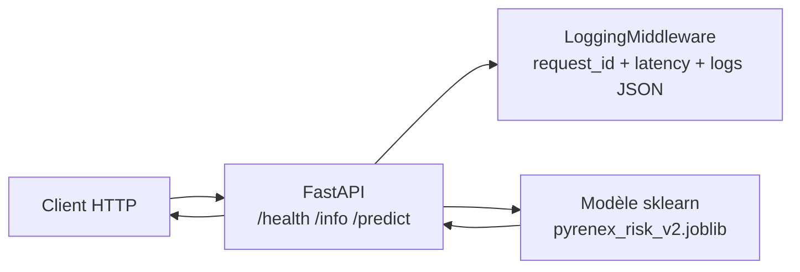

# Pyrenex Risk API

API FastAPI servant un modèle de scoring crédit Pyrenex.  
Le modèle prédit le risque de défaut d’un prêt à partir des caractéristiques du dossier emprunteur.

## Architecture


---

## Démarrage (4 commandes)
```bash
docker build -t pyrenex-risk-api .
docker run -p 8000:8000 pyrenex-risk-api
curl http://localhost:8000/health
```
Ensuite (autre terminal) :

```bash
curl http://localhost:8000/health
curl http://localhost:8000/info
pytest -v                                              # → 1 test exemple passe
```

---

## Structure du repo

```
M1-B2-scoring-api-<prenom>/
├── app/
│   ├── __init__.py
│   ├── main.py                  # FastAPI app + lifespan + routes
│   ├── schemas.py               # Pydantic schemas (LoanApplication, Prediction)
│   └── middleware.py            # LoggingMiddleware Loguru
├── tests/
│   ├── __init__.py
│   ├── conftest.py              # fixtures pytest (client + valid_payload)
│   ├── test_model_contract.py   # test 0 — valide le .joblib avant l'API
│   └── test_api.py              # tests routes /health, /info, /predict
├── models/                      # ton .joblib + .json depuis M1-B1
│   └── .gitkeep
├── logs/                        # logs rotatifs (gitignored)
│   └── .gitkeep
├── ressources/                  # 📚 mini-cours d'appui (lecture juste-à-temps)
│   ├── 01_FastAPI_Pydantic_ml_essentiel.md
│   ├── 02_Dockerfile_Python_essentiel.md
│   ├── 03_Pytest_TestClient_essentiel.md
│   ├── 04_Loguru_middleware_essentiel.md
│   ├── 05_Versionning_modele_essentiel.md
│   ├── liens_officiels.md
│   └── README.md                # ordre de mobilisation + objectifs
├── Dockerfile                   # à compléter (cf. ressources/02)
├── .dockerignore
├── .gitignore
├── requirements.txt
└── README.md (ce fichier — à compléter avec schéma Mermaid + démarrage)
```

---

## Versionning

La version du modèle actuellement servie est exposée par l'endpoint
```bash
curl http://localhost:8000/info
```

## Logs

Chaque requête est tracée via Loguru dans logs/api.log.

Le niveau de log peut être configuré avec la variable d’environnement LOG_LEVEL.